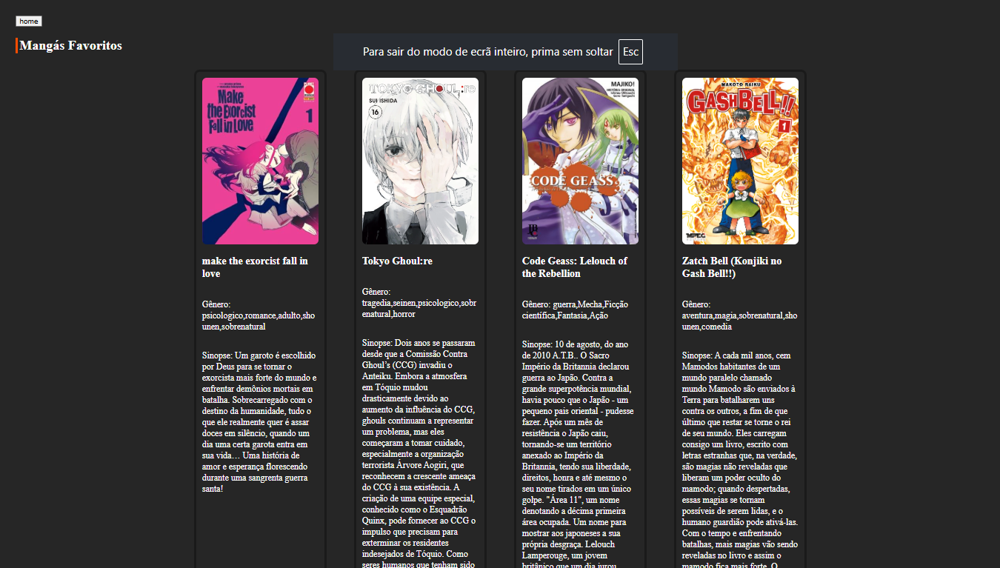

# site de Mangás

## ✅ Funcionalidades:

- 📄 Listagem de todos os mangás do banco de dados (PostgreSQL)
- ⭐ Página de favoritos
- 🔎 Visualização de detalhes de cada mangá (Capa, Nome, Gênero e Sinopse)
- 🔄 Atualização automática dos dados (sempre que adicionar um novo mangá no BD, ele aparece no site sem precisar alterar o código)
- 🎨 layout inspirado no Manga Livre

## imagens

 
## ✅ Exemplo de JSON retornado pela API:
```json
[
  {
    "id": 1,
    "capa": "https://exemplo.com/capa1.jpg",
    "name": "Naruto",
    "genero": "Ação, Aventura, Shounen",
    "sinopse": "Naruto Uzumaki é um jovem ninja determinado a se tornar Hokage..."
  },
  {
    "id": 2,
    "capa": "https://exemplo.com/capa2.jpg",
    "name": "One Piece",
    "genero": "Aventura, Fantasia, Shounen",
    "sinopse": "Monkey D. Luffy parte em uma jornada para encontrar o tesouro One Piece..."
  }
]

## contato:
